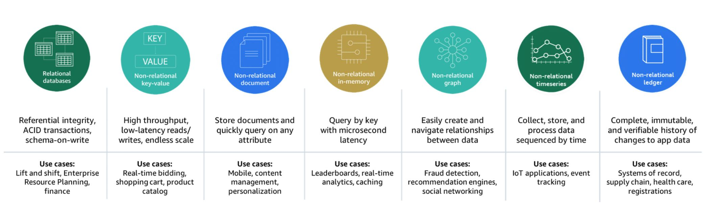
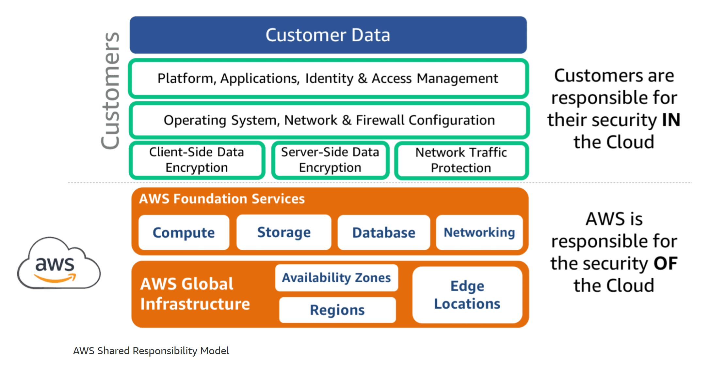

# AWS for Architect Quick Reference Guide
A must known resources of AWS for Architects and Cloud engineer

# AWS resource Icons and PPT sample

[Icon Pack](https://aws.amazon.com/architecture/icons/)

[PPT](https://aws.amazon.com/architecture/icons/)

## AWS Knowledge Center aka Premimum Support

The Knowledge Center page contains links to nearly 1,000 questions arranged by service,
each representing a fairly common problem encountered by real AWS customers. You’ll find
questions like, “How can I install the AWS CloudFormation helper scripts on Ubuntu or
Red Hat Enterprise Linux?” and “What happens when my reserved instance expires?”

Get answer to all "how to questions" on AWS service usage

[AWS Premimum Service](https://aws.amazon.com/premiumsupport/knowledge-center/)

# AWS Sample - Distributed ML model training

(github link)[https://github.com/aws-samples/awsome-distributed-training]

# AWS Well Architecture framework

Remember P.R.O.C.E.S.S to recall fast (E has no meaning)

[wellarchitectedlabs](https://www.wellarchitectedlabs.com/cost/100_labs/100_5_cost_visualization/)

1. Performance
2. Reliability
3. Operational Excellence
4. Cost Optimization
5. E - has no meaning**
6. Security
7. Sustainability

## Cloud Architecture Design principle

1. Design for Failures ( atleast 2 EC2 instances, as anything may fail )
2. Decouple or Loose coupling ( Microservice Architecture, deploy with low dependency, Avoid monolith Apps, Don't install DB on EC2 where App is installed )
3. Elasticity ( Horizontal scaling - Scale-in and Scale-out based on demand )
4. Parallel ( 2 EC2 instaces serving live traffic with ALB )

## AWS Cloud Economics

1. Cost savings ( Cost reduction with On-demand Pay-as-you go model and Spot instances )
2. Staff productivity ( Infrastructure configuration overhead reduced. move away from the day-to-day operational headaches associated with managing IT
infrastructure )
3. Operational resilience (improving SLAs and reducing unplanned outages. AWS CloudFormation/Terraform to automate infra to avoid human errors)
4. Business agility ( Deploying new features/applications fasterand reducing errors. Developers don’t have to wait to get the budget to deploy a full infrastructure )

More on Economics: The rightsizing recommendations feature in Cost Explorer (AWS Cost Management) helps you identify cost-saving opportunities by downsizing or terminating instances in Amazon Elastic Compute Cloud (Amazon EC2). Rightsizing recommendations analyze your Amazon EC2 resources and usage to show opportunities for how you can lower your spending.
[cost optimization](https://docs.aws.amazon.com/cost-management/latest/userguide/ce-rightsizing.html)

# AWS Well Architectedlabs

[Well Architected](https://www.wellarchitectedlabs.com/)

# AWS Database Purpose

# AWS Shared Security model

# Sample Source code to connect different AWS services

[AWS SDK sample code Java](https://github.com/awsdocs/aws-doc-sdk-examples/tree/main/javav2/example_code)

[Java Sample](https://github.com/awsdocs/aws-doc-sdk-examples/tree/main/javav2/example_code/s3)

[Python Sample](https://github.com/awsdocs/aws-doc-sdk-examples/tree/main/python/example_code)

# Reference Architecture Diagram

[Find Architecture Diagram](https://aws.amazon.com/architecture/reference-architecture-diagrams)

## Price calculator

[simple AWS price calculator](https://calculator.s3.amazonaws.com/index.html)

## AWS Support Plans

1. Basic ( Free of cost )
2. Developer ( Associate available during business hours - chat/email and production downtime help within 1 hour )
3. Business ( Engineer available 24/7 - call/email/chat and production downtime help within 1 hour )
4. Enterprise ( Senior engineer available 24/7 - call/email/chat and production downtime help within 1 hour plus business critial apps support within 15 min. Technical account manager is assigned to your organization/account for planning, deployment and recommendation )

# Learn by doing

[Skill builder](https://skillbuilder.aws)

[Repost - Ask your technical question and get Expert answer](https://repost.aws)

[Hands on workshop and Tutorial](https://workshops.aws)

[Price calculator](https://calculator.aws)

[AWS training](https://aws.training)

[SageMaker Free lab](https://studiolab.sagemaker.aws)

[bugbust - Submit Bug and Win](https://bugbust.aws/)

[Community Help](https://honeycodecommunity.aws/)

# AWS archives

[AWS Archive](https://github.com/amazon-archives/)

[Sample App with DynamoDB](https://github.com/amazon-archives/aws-full-stack-template)
