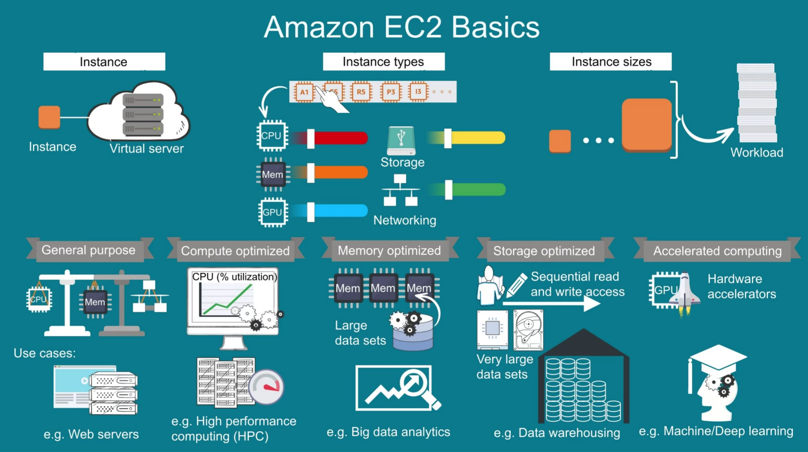
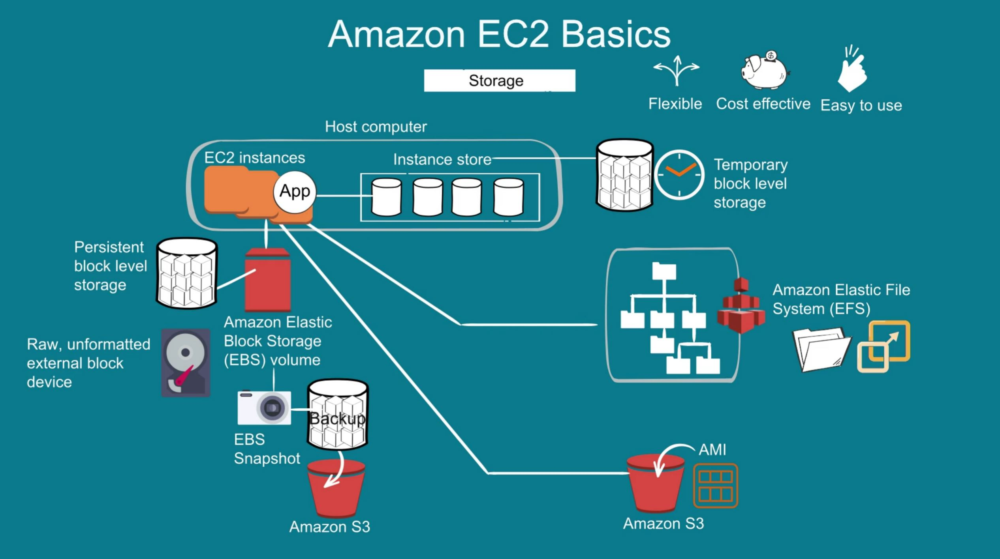
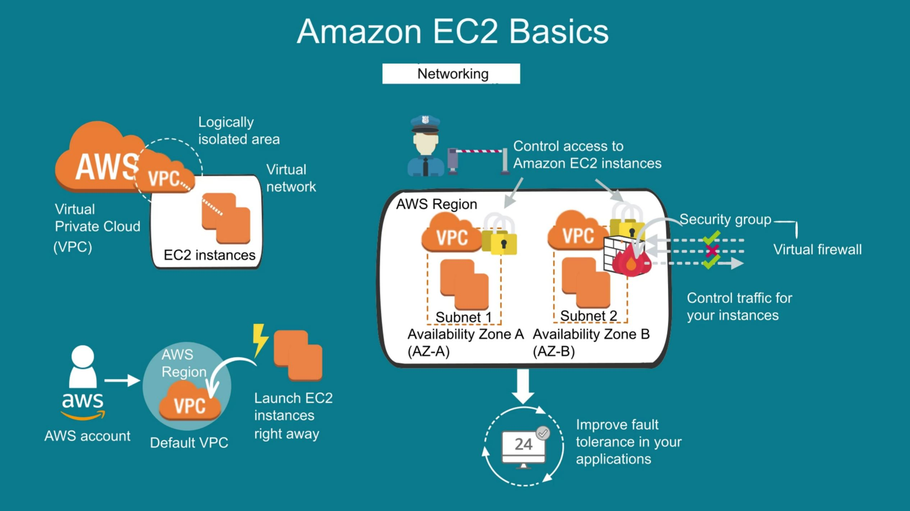
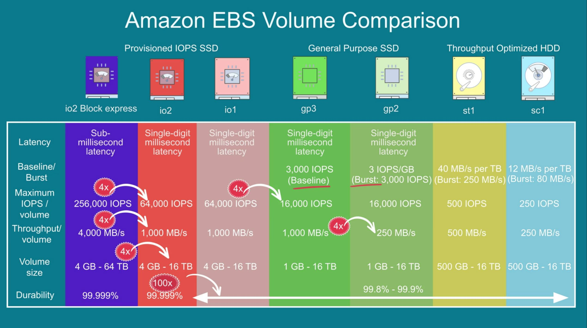
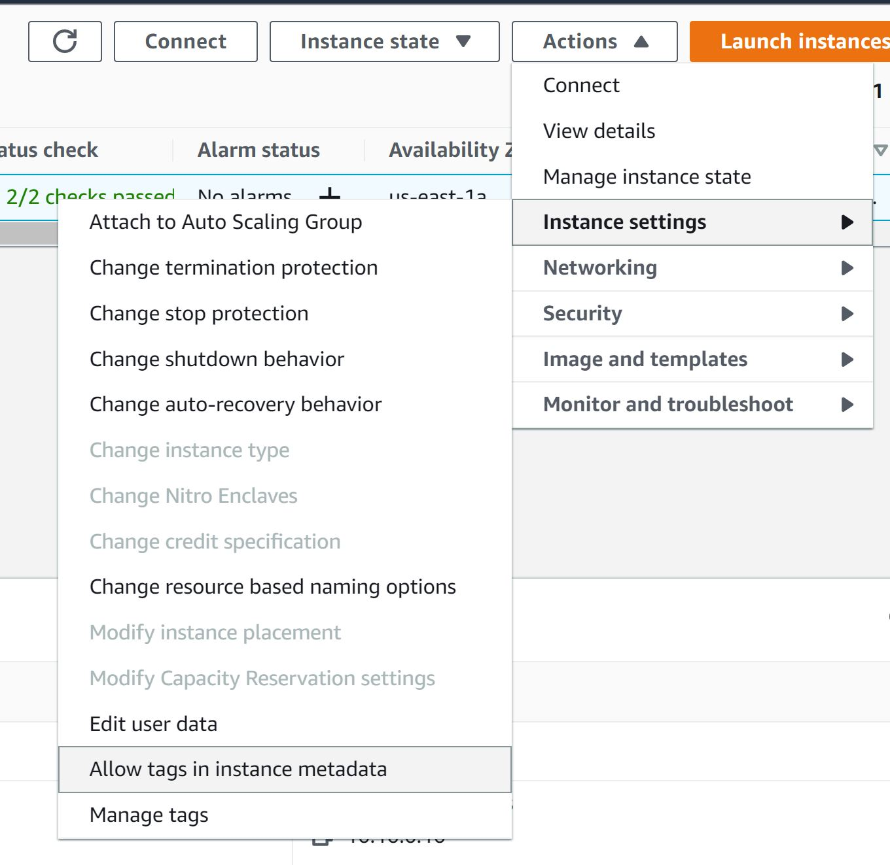
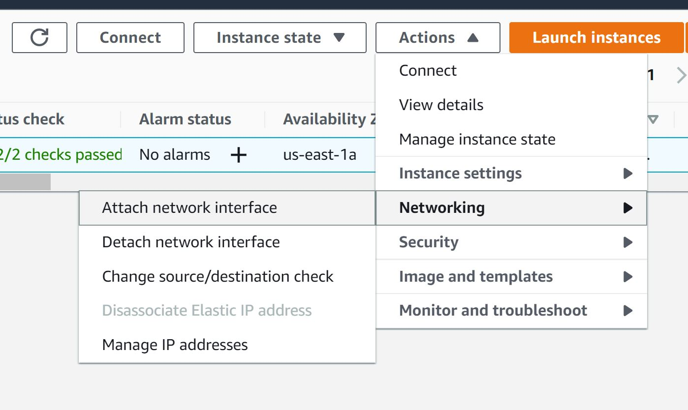

# EC2 Instances

# EC2 Instance Types

1. General purpose
2. Compute optimized
3. Memory optimized
4. storage optimized
5. Accelerated computing

# EC2 Security Group aka Firewall

In each instance, AWS provides Firewall called Security Group to control inbound/outbound traffic.

Bydefault all inbound traffic are blocked in Security Group.

# EC2 Storage types

# EC2 Storage types

1. Instance storage (Temporary storage)
2. EBS - Elastic Block Storage ( Permanent storage ), 1 EBS can be attached to 1 EC2 only. Provides snapshot backup. Storage size is fixed.
3. EFS - Elastic File system ( File/Tree based storage ) 1 EFS can be attached to multiple EC2 instances. Storage size scale automatically.
4. S3

## EBS
EBS is a block storage service, which means all data within EBS is stored in equally sized blocks. This system offers some performance advantages over traditional storage, and generally boasts lower latency, too.

1. Low-latency performance – Up to 16,000 IOPS for General Purpose SSDs and up to 256,000 IOPS for the new Provisioned IOPS SSD
2. Easy data backup and restoration – via snapshots that can be taken at hourly intervals, EBS ensures all your data is well protected
3. Highly available – 99.8% – 99.9% for General Purpose SSDs and 99.999% for the Provisioned IOPS SSD
4. EBS encryption – there’s no need to worry about key management, as EBS handles that for you.

## EFS

EFS can be mounted by multiple EC2 instances, meaning many virtual machines may store files within an EFS instance. 
But its main feature is its scalability. EFS can grow or shrink according to demand, with more and more files being added without disturbing your application or having to provision new infrastructure.

EFS may be used whenever you need a shared file storage option for multiple EC2 instances with automatic, high-performance scaling. 

## S3

S3 is scalable, like EFS, and has access to multiple EC2 instances. However, it can also be accessed by other cloud services, and its object storage system makes it ideal for handling large volumes of static data as well as complex queries.

1. Running analytics – because S3 can interface with other services like AWS Lake Formation and analytics tools, it can be used as a data lake, with other services running complex queries on its data to draw insights
2. Data archiving – S3 is capable of archiving data, meaning simpler forms of your data can be stored at a lower cost than a ‘fuller’ version would
3. Incredibly durable – Amazon S3 Standard, S3 Standard–IA, S3 Intelligent-Tiering, S3 One Zone-IA, S3 Glacier, and S3 Glacier Deep Archive are all designed to provide 99.999999999% (11 9’s) of data durability of objects over a given year. This durability level corresponds to an average annual expected loss of 0.000000001% of objects. If you store 10,000,000 objects with Amazon S3, you can on average expect to incur a loss of a single object once every 10,000 years.

# EC2 Networking

# EBS type that can be attached to EC2

# Quick EC2 management features on AWS portal

