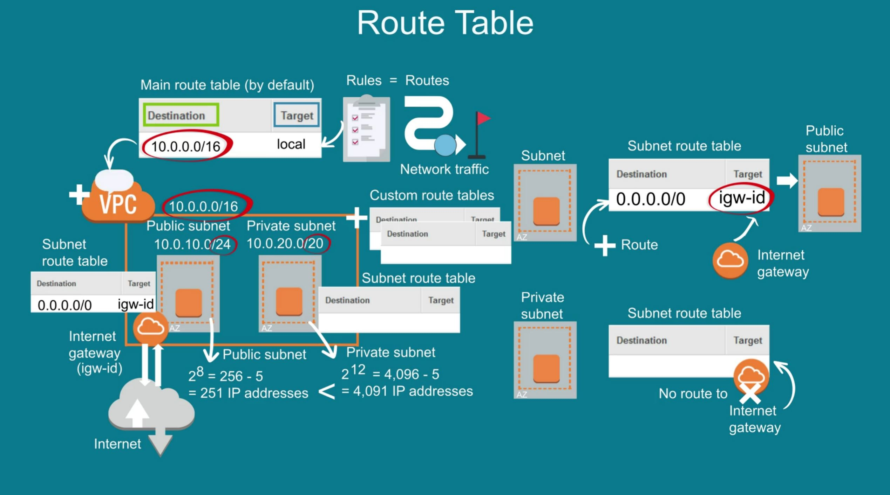

# AWS VPC

1. VPC is isolated but are managed in place where other customer do have their VPC
2. VPC Peering
3. VPC are restricted to use in 1 Region (multiple AZs)
4. VPC comes with default Roting table and we can create our custom Routing table
5. Network Access Control List ( NACL) is used to control traffic at subnet level
6. VPC comes with default NACL, which allows inbound and outbound traffic bydefault.
7. In NACL, lowest numer/digit means, AWS with give more priority while checking rules

# Routing Table
1. VPC comes with default Roting table and we can create our custom Routing table
2. Routing table has Source and Destination
3. Target can be igw and destination can be 0.0.0.0/0 (any) for public subnet
4. Target can be nat and destination can be 0.0.0.0/0 (any) for private subnet

# CIDR

CIDR has total 32bits, as each (x) has 8 bit, combine 4 x we will have 32 bit.

x.x.x.x which is 8 * 4 = 32 bit  (each X has 8 bit and total we have 4 x/numbers)

what is the meaning of 10.0.10.1/16 ?

Let's calculate Total IPs:

32 - 16 = 16

then 2 to the power 16 i.e. 216 = 65536 IPs

Out of which, 5 will be reserved by AWS for internal use.

Along with primary CIDR block, we are create secondary CIDR block to expand VPC.
But there is limitation of secondary CIDR block.

CIDR block should never overlap, anyways AWS throws error when you do that.

# Subnet

Each subnet must be attached with a routing table.

If Internet Gateway is attached, then its called Public subnet.

If Internet Gateway is not attached, then its called Private subnet.

1 Subnet can have only 1 NACL attached. Bydefault Custom NACL blocks inbound and outbound traffic.

# Internet Gateway and Nat Gateway

# Outbound internet for IPV6 private subnet

