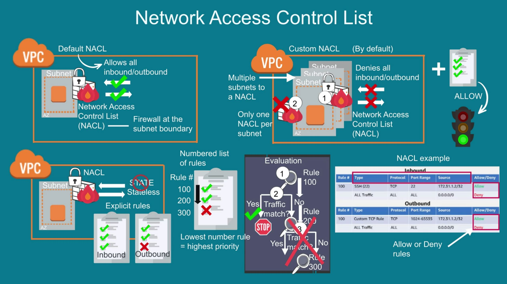

# AWS VPC

1. VPC is isolated but are managed in place where other customer do have their VPC
2. VPC Peering ( 2 connect 2 VPC present in different region or same region)
3. VPC are restricted to use in 1 Region (multiple AZs)
4. VPC comes with default Roting table and we can create our custom Routing table

Deep concept
1. VPC is always attached with 1 Main Routing Table
2. Always attached with 1 NACL
2. Always attached with 1 Primary CIDR

# AWS NACL - at subnet level

Network ACLs allow or deny specific inbound and outbound traffic at the subnet level.

1. Network Access Control List ( NACL) is used to control traffic at subnet level
2. VPC comes with default NACL, which allows inbound and outbound traffic bydefault.
3. In NACL, lowest numer/digit means, AWS with give more priority while checking rules

While creating NACL rule, we need to supply following details

1. Rule Number (priority)
2. Type ( SSH, custom text)
3. Protocol ( http, tcp, udp )
4. Port Range ( single port and port range 22-2222)
5. Source ( from which ip it will be allowed/dedined, 0.0.0.0/0 means all)
6. Allow/

By default AWS adds block All traffic and kept has lowest priority so that your custom rule get more priority.

# Routing Table
1. VPC comes with default Roting table and we can create our custom Routing table
2. Routing table has Source and Destination
3. Target can be igw and destination can be 0.0.0.0/0 (any) for public subnet
4. Target can be nat and destination can be 0.0.0.0/0 (any) for private subnet

# CIDR

The CIDR block size must have a size between /16 and /28 range.

CIDR has total 32bits, as each (x) has 8 bit, combine 4 x we will have 32 bit.

x.x.x.x which is 8 * 4 = 32 bit  (each X has 8 bit and total we have 4 x/numbers)

what is the meaning of 10.0.10.1/16 ?

Let's calculate Total IPs:

32 - 16 = 16

then 2 to the power 16 i.e. 216 = 65536 IPs

Out of which, 5 will be reserved by AWS for internal use.

Along with primary CIDR block, we are create secondary CIDR block to expand VPC.
But there is limitation of secondary CIDR block.

CIDR block should never overlap, anyways AWS throws error when you do that.

# Subnet

Each subnet must be attached with a routing table.

Each subnet must reside entirely within one Availability Zone and cannot span zones

If Internet Gateway is attached, then its called Public subnet.

If Internet Gateway is not attached, then its called Private subnet.

1 Subnet can have only 1 NACL attached. Bydefault Custom NACL blocks inbound and outbound traffic.

The CIDR block of a subnet can be the same as the CIDR block for the VPC (for a single subnet in the VPC), or a subset of the CIDR block for the VPC (to create multiple subnets in the VPC). The allowed block size is between a /28 netmask and /16 netmask. If you create more than one subnet in a VPC, the CIDR blocks of the subnets cannot overlap.

For example, if you create a VPC with CIDR block 10.0.0.0/24, it supports 256 IP addresses. You can break this CIDR block into two subnets, each supporting 128 IP addresses. One subnet uses CIDR block 10.0.0.0/25 (for addresses 10.0.0.0 - 10.0.0.127) and the other uses CIDR block 10.0.0.128/25 (for addresses 10.0.0.128 - 10.0.0.255).

There are tools available on the internet to help you calculate and create IPv4 subnet CIDR blocks. You can find tools that suit your needs by searching for terms such as 'subnet calculator' or 'CIDR calculator'. Your network engineering group can also help you determine the CIDR blocks to specify for your subnets.

The first four IP addresses and the last IP address in each subnet CIDR block are not available for your use, and they cannot be assigned to a resource, such as an EC2 instance. For example, in a subnet with CIDR block 10.0.0.0/24, the following five IP addresses are reserved:

1. 10.0.0.0: Network address.

2. 10.0.0.1: Reserved by AWS for the VPC router.

3. 10.0.0.2: Reserved by AWS. The IP address of the DNS server is the base of the VPC network range plus two. For VPCs with multiple CIDR blocks, the IP address of the DNS server is located in the primary CIDR. We also reserve the base of each subnet range plus two for all CIDR blocks in the VPC. For more information, see Amazon DNS server.

4. 10.0.0.3: Reserved by AWS for future use.

5. 10.0.0.255: Network broadcast address. We do not support broadcast in a VPC, therefore we reserve this address.

# Internet Gateway and Nat Gateway

# Outbound internet for IPV6 private subnet

# VPC Peering

1. first create a VPC peering with source and target ( requester and Accepter )
2. selecting the peering vpc, then from the action menu, accept the peering at the accepter VPC
3. Now need to change routing table of both source vpc and target vpc
4. then in target EC2 add security group rules to allow traffic from specific vpx

