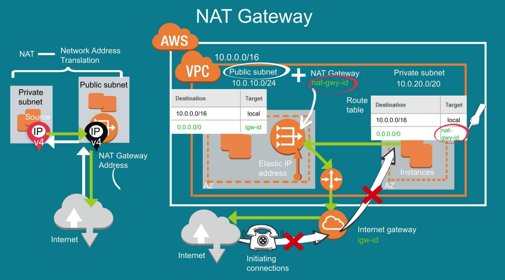

# AWS VPC

VPC details

# CIDR

CIDR has total 32bits, as each (x) has 8 bit, combine 4 x we will have 32 bit.

x.x.x.x which is 8 * 4 = 32 bit  (each X has 8 bit and total we have 4 x/numbers)

what is the meaning of 10.0.10.1/16 ?

Let's calculate Total IPs:

32 - 16 = 16

then 2 to the power 16 i.e. 216 = 65536 IPs

Out of which, 5 will be reserved by AWS for internal use.

# Internet Gateway and Nat Gateway

# Outbound internet for IPV6 private subnet

