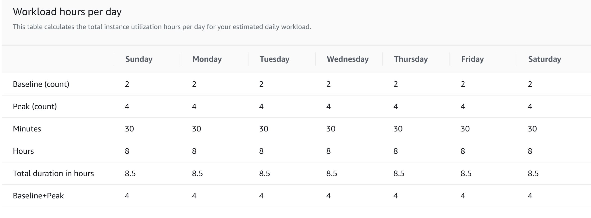
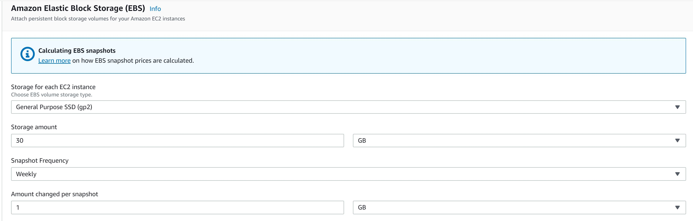

# How AWS Charge

* All data coming from internet to AWS is free
* Internal Region communication is chargeable
* All outbound data are chargeable

# Instance Calculator

* On-Demand instance hours: 1977.0834
* 1977.0834 On-Demand instance hours x 0.0464 USD = 91.736670 USD
* On-Demand instances (monthly): 91.736670 USD

# EBS calculation

* 1,977.0834 total EC2 hours / 730 hours in a month = 2.71 instance months
* 30 GB x 2.71 instance months x 0.10 USD = 8.13 USD (EBS Storage Cost)
* EBS Storage Cost: 8.13 USD
* Total snapshots: 3
* Initial snapshot cost: 30 GB x 0.0500000000 = 1.5 USD
* Monthly cost of each snapshot: 1 GB x 0.0500000000 USD = 0.05 USD
* Discount for partial storage month: 0.05 USD x 50% = 0.025 USD
* Incremental snapshot cost: 0.025 USD x 3 = 0.075 USD
* Total snapshot cost: 1.5 USD + 0.075 USD = 1.575 USD
* 1.575 USD x 2.71 instance months = 4.27 USD (total EBS snapshot cost)
* 8.13 USD + 4.27 USD = 12.40 USD (Total EBS cost)
* Amazon Elastic Block Storage (EBS) total cost (monthly): 12.40 USD

## AWS tool to manage cost

### AWS Budget 
Set custom budgets that alert you when you exceed your budgeted thresholds.

If Cost Explorer don't have any billing data ( new account or no resource running case), then you will get following error in AWS budget tool, while creating customized budget.

Because Cost Explorer is not enabled for this account, AWS Budgets does not have access to your billing data. This limits the creation of some budget types and configuration options. To enable these options, either create a budget or enable Cost Explorer. Changes can take up to 24 hours to take effect

* Cost budget - Recommended
Monitor your costs against a specified dollar amount and receive alerts when your user-defined thresholds are met. Using cost budgets, the budgeted amount you set represents your expected cloud spend. For example, you can set a cost budget for a business unit and then add additional parameters such as the associated member accounts.

* Usage budget
Monitor your usage of one or more specified usage types or usage type groups and receive alerts when your user-defined thresholds are met. Using usage budgets, the budgeted amount represents your expected usage. For example, you can use a usage budget to monitor the usage of certain services such as Amazon EC2 and Amazon S3.

* Savings Plans budget
Track the utilization or coverage associated with your Savings Plans and receive alerts when your percentage drops below a threshold you define. Setting a coverage target lets you see how much of your instance usage is covered by Savings Plans, while setting a utilization target lets you see if your Savings Plans are unused or underutilized.

* Reservation budget
Track the utilization or coverage associated with your reservations and receive alerts when your percentage drops below a threshold you define. Setting a coverage target lets you see how much of your instance usage is covered by reservations, while setting a utilization target lets you see if your reservations are unused or underutilized. Reservation alerts are supported for Amazon EC2, Amazon RDS, Amazon Redshift, Amazon ElastiCache, and Amazon Elasticsearch reservations.

Price/charge for using AWS Budget: AWS Budgets lets you set custom cost and usage budgets that alert you when your budget thresholds are exceeded (or forecasted to exceed). You can also create budgets to track your aggregate Reservation and Savings Plans utilization and coverage metrics. You can monitor and receive notifications on your budgets free of charge.

In addition to budget monitoring, you can add actions to your budgets to control IAM and Service Control Policy permissions as well as AWS resources when thresholds are exceeded (or forecasted to exceed). Your first two action-enabled budgets are free (regardless of the number of actions you configure per budget) per month. Afterwards each subsequent action-enabled budget will incur a $0.10 daily cost.

###  AWS Cost Explorer 

Cost Explorer provides reporting, analytics and visualization capabilities that you can use to track and manage your AWS costs.
You will be able to see your spend data within 24 hours after you launch Cost Explorer for the first time.)

## How to Optimize cost on AWS

General Rule of thumb:

✅ Run your final workload for 3~4 months and keep eyes on utilization before opt for reserved instances.

✅ Configure Cloud Watch to keep eyes on resource utilization

✅ Within that 3~4 months, keep tweaking right sizing (CPU, RAM, Class) to fit your need. Applicable to all AWS service which allows change in instance type/class.

✅ 70-80% of your workflow should use reserved instance and another 20~30% workload should use On-Demand and Spot instance.

✅ Workload which are ok to be impacted due to node failures, should use Spot instances. Example Big Data processing using Spark.

✅ Dev/Test instances should be Auto shutdown when its not in use. Simply using Cloud Watch+lamba function. Example instance shutdown/destroy on Weekends and Post business Hours.

✅ Down scale instance post business hours. If Your application is not being used by users post particular working hours.

✅ Start using Cache ( Redis or Memcached ) in your application to reduce your bill. As getting data out of AWS RDS/Other services impacts on Cost.

✅ Keep your Transactional work and Analytical work as separate workload. You can move data from main RDS to analytics database. So need to understand RDS vs S3 vs RedShift.

✅ Understand difference between AWS RDS, NoSQL, Analytics DB and Cache DB

Operational:

✔️ Use Consolidated Billing by using AWS Organization. Many AWS Services provides volume pricing tiers discount across certain usage dimensions. But applicable for company/user who is having large clusters on AWS.

✔️ One Auto-scaling group can be setup for On-Demand type instances and another Auto-scaling group can be setup for Spot instances. This is applicable to workload running on EC2 and EKS.

✔️ Automate Dev/Test type instance Spin and Destroy using Terraform or Cloud Formation. Also Plan for Downscaling and upscaling with automation if destroy is not possible.

✔️ Move unused data on S3 to lower tier S3 class. Completely unused data can be moved to Glacier.

✔️ Think where you can use AWS Lamda for short lived task. But do remember that also makes your application non cloud agnostic.

✔️ Use as much AZs as possible. If you need 30 instances, in-case you are using 2 AZs and you are running 15 instance in each AZ. But the better setup would be use 10 instance in each AZ and take 3rd AZ if its available to you.

Start using AWS Services to optimize cost:

☑️ Trusted Advisor - Will give tips to optimize your use of aws resources.

☑️ AWS Budget - Get Alerts when your usage hit a threshold.

☑️ AWS Cost Explorer - Review cost and Billing. In-case you are not using reserve instances, you will get recommendation for that. If you are already using Reserved instances, you will get utilization report.

☑️ Use CloudWatch wisely. Not to forget cloud watch provides 10 free alerts configuration.

