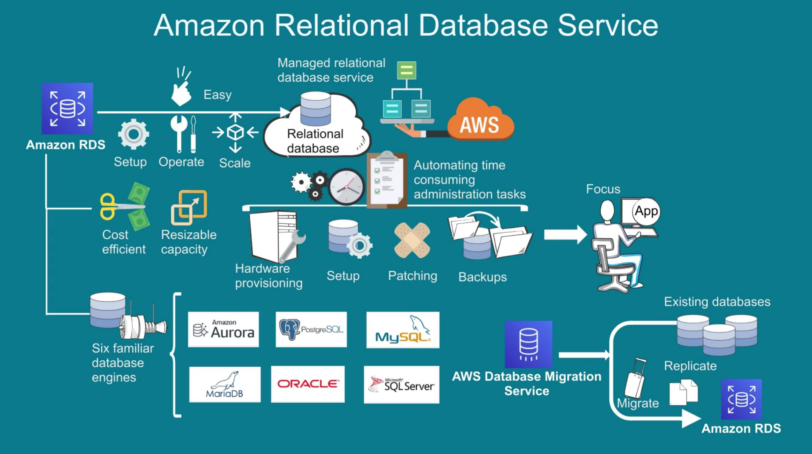

# RDS

## Configuring DB in a VPC

[Working with a DB instance in a VPC](https://docs.aws.amazon.com/AmazonRDS/latest/UserGuide/USER_VPC.WorkingWithRDSInstanceinaVPC.html)

[RDS for Developer](https://aws.amazon.com/rds/resources/)

[Quick Demo](https://explore.skillbuilder.aws/files/a/w/aws_prod1_docebosaas_com/1663495200/2HKpYD8YqBZB2VPPwyILrQ/tincan/e92d27afbf892bd9807456c5d88e791f486908d4/assets/w3gfFxG5PJwmj9JB_transcoded-M0j_riHCi1_zuvc0-rds-demo.mp4)

## RDS Aurora

1. Can create upto 15 Read Replicas. Can help in failure over as well.
2. Auto switch to healthy DB instance in-case of db failure without any data loss
3. Aurora is efficient compared to mysql or pgsql because of re-engineering of Log structured distrubuted storage layer (storage method)
4. Aurora stores 6 copies of your data in 3 AZs
5. encryption at rest and transit is available
6. Also it comes with isolation

### RDS Aurora Billing model

1. Aurora comes with 3 pricing model with type of hosting ondemand, Reserved (1-3 years contract), serveless based on capacity
2. Storage cost is Storage per gb per month
3. traffic cost is Input i/o per million request
4. backup cost is User initiated backup per gb per month
5. Data transferred to other AWS region or to outbound internet
6. No cost within same Region or same VPC
