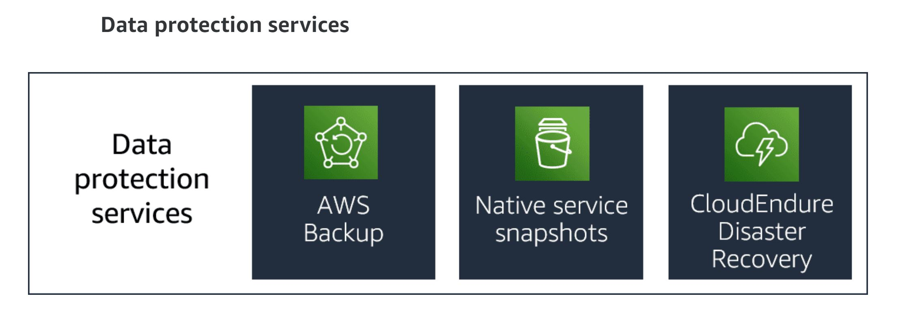

# Data protection services

Data protection services provide optional services to meet your data redundancy and disaster requirement needs. Some services are standalone service options and some are integrated into the core storage services. 

## Backup and Archive

Using AWS Backup, you can centralize and automate data protection across AWS services. AWS Backup offers a cost-effective, fully managed, policy-based service that further simplifies data protection at scale. AWS Backup also helps you support your regulatory compliance or business policies for data protection.

When you combine AWS Organizations with AWS Backup, you can deploy data protection policies centrally. Centrally deploy policies to configure, manage, and govern your backup activity across your company’s AWS accounts and resources. Resources include the following:

1. Amazon EC2 instances
2. Amazon EBS volumes
3. Amazon RDS databases (including Amazon Aurora clusters)
4. Amazon DynamoDB tables
5. Amazon Neptune databases
6. Amazon DocumentDB (with MongoDB compatibility) databases 
7. Amazon EFS
8. Amazon FSx for Lustre
9. Amazon FSx for Windows File Server
10. AWS Storage Gateway volumes
11. Amazon Simple Storage Service (Amazon S3) buckets
12. VMware workloads on premises and in VMware CloudTM on AWS

## Snapshots

Native snapshot services are built into most core services. Snapshots create backup copies of your data. Snapshots are stored in a protected part of Amazon S3 as part of the managed service. Storing snapshots on Amazon S3 protects your data with 99.999999999 percent (11 9s) of durability and provides you Regional access and availability.

Snapshots are incremental copies of the data, which means that only the data that has changed after your most recent snapshot is saved in the next incremental snapshot. Incremental snapshots reduce the time required to create the snapshot. These incremental snapshots save on storage costs by not duplicating previously saved data. Each snapshot contains all of the information for that point in time that is needed to restore your data.