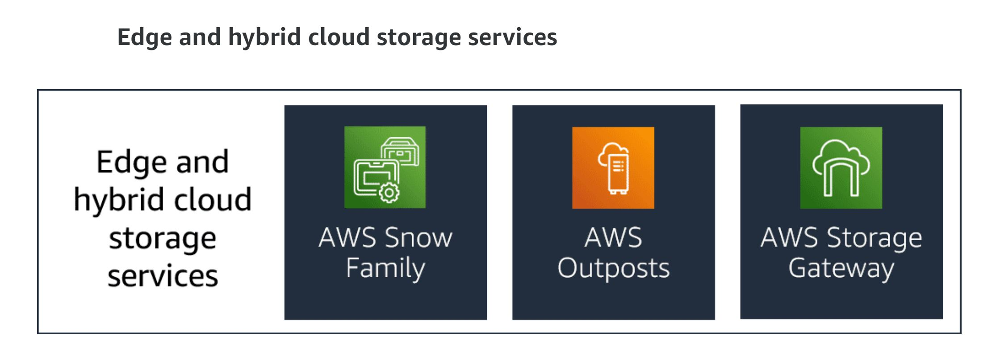

# AWS Edge Storage

## Edge Storage

With edge location compute and storage services, you can use compute resources and storage services even when disconnected from the AWS Cloud. They also provide a data transfer platform to copy your data in to and out from the AWS Cloud. You can transfer your data by shipping the devices to AWS for import or use the device as a remote data synchronization client. 

Edge location devices include the AWS Snow Family of products: AWS Snowball devices, AWS Snowcone devices, and AWS Snowmobile service.

AWS Snowball is an edge computing, data migration, and edge storage device. You can use these devices for the following:
Data collection
Machine learning and processing
Storage in environments with intermittent connectivity or in remote disconnected locations
Snowball Edge comes in two options: Storage Optimized for the highest storage capacity and Compute Optimized for more available vCPUs with a lower storage capacity.
AWS Snowcone is the smallest member of the AWS Snow Family of edge computing, edge storage, and data transfer devices, weighing in at 4.5 pounds (2.1 kg). Snowcone is ruggedized, secure, and purpose-built for use outside of a traditional data center.
AWS Snowmobile is an exabyte-scale data transfer service used to move large amounts of data to AWS. You can transfer up to 100 PB per Snowmobile, a 45-foot long ruggedized shipping container, pulled by a semitrailer truck. Snowmobile makes it easy to move massive volumes of data to the cloud, including video libraries, image repositories, or even a complete data center migration.

## Hybrid - On-premises cloud storage

On-premises cloud storage is provided as part of an AWS Outposts implementation and includes Amazon EBS and Amazon S3 storage services.

AWS Outposts is a fully managed service that offers the same AWS infrastructure, AWS services, APIs, and tools to virtually any data center, colocation space, or on-premises facility. These capabilities provide a consistent hybrid experience. AWS Outposts is ideal for the following:

1. Workloads that require low latency access to on-premises systems, local data processing, and data residency
2. Migration of applications with local system interdependencies

AWS compute, storage, database, and other services run locally on Outposts. You can access the full range of AWS services available in the Region to build, manage, and scale your on-premises applications using familiar AWS services and tools.

## Hybrid - AWS Storage Gateway

AWS Storage Gateway connects on-premises users and applications using a software appliance with cloud-based storage. It provides integration between an organization’s on-premises IT environment and the AWS storage infrastructure. You can use Storage Gateway to simplify storage management and reduce costs for key hybrid cloud storage use cases. 

Use cases include the following: 

1. Moving backups to the cloud
2. Using on-premises file shares backed by cloud storage
3. Providing low-latency access to data in AWS for on-premises applications. Local caching reduces network latency for both read and write activities.

Storage Gateway offers four different types of gateways: Amazon S3 File Gateway, Amazon FSx File Gateway, Volume Gateway, and Tape Gateway.

1. Amazon S3 File Gateway provides a seamless way to connect to the cloud to store application data files and backup images as durable objects in Amazon S3. Amazon S3 File Gateway offers SMB or NFS-based access to data in Amazon S3 with local caching.

2. Amazon FSx File Gateway optimizes on-premises access to fully managed, highly reliable file shares in Amazon FSx for Windows File Server. Customers with unstructured or file data, whether from SMB-based group shares or business applications, might require on-premises access to meet low-latency requirements.

3. Volume Gateway presents cloud-backed iSCSI block storage volumes to your on-premises applications. Volume Gateway stores and manages on-premises data in Amazon S3 on your behalf and operates in cache mode or stored mode.

4. Tape Gateway is used to replace physical tapes on premises with virtual tapes in AWS without changing existing backup workflows. Tape Gateway supports all leading backup applications and caches virtual tapes on premises for low-latency data access.