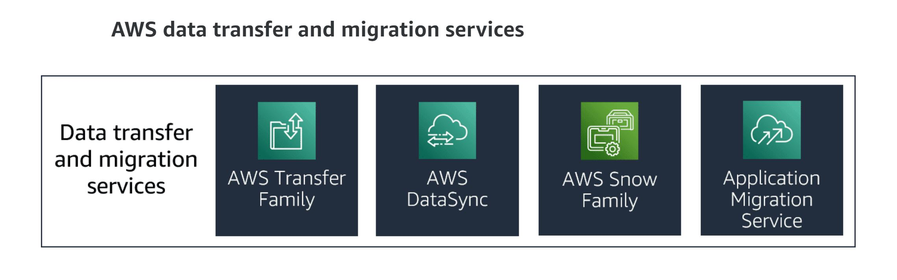

# File Migration/Transfer Service

## File Transfer Service

The AWS Transfer Family provides fully managed support for file transfers directly into and out of Amazon S3 or Amazon EFS. AWS Transfer Family includes support for Secure File Transfer Protocol (SFTP), File Transfer Protocol over SSL (FTPS), and File Transfer Protocol (FTP).

The AWS Transfer Family helps you to migrate your file transfer workflows to AWS by doing the following so that nothing changes for you or your applications

1. Integrating with the specified authentication system
2. Providing DNS routing with Amazon Route 53

## Data synchronization and online transfer services

AWS DataSync is an online data transfer service that simplifies, automates, and accelerates moving data between on-premises storage systems and AWS Storage services and between AWS Storage services. You can use DataSync for the following operations:

1. Migrate active datasets to AWS
2. Archive data to free up on-premises storage capacity
3. Replicate data to AWS for business continuity
4. Transfer data to the cloud for analysis and processing

DataSync can copy data between the following resources or services:

1. Network File System (NFS) shares
2. SMB shares
3. Self-managed object storage
4. AWS Snowcone
5. Amazon S3 buckets
6. Amazon EFS file systems
7. Amazon FSx for Windows File Server file systems

## Offline data transfer and migration services

Offline data transfers are performed using AWS Snow Family devices. The AWS Snow Family helps customers who need to run operations in austere, non-datacenter environments, and in locations where there’s lack of consistent network connectivity.

The Snow Family, comprised of AWS Snowcone, AWS Snowball, and AWS Snowmobile, offers several physical devices and capacity points, most with built-in computing capabilities. These services help to physically transport up to exabytes of data into and out of AWS.

AWS owns and manages Snow Family devices. The devices integrate with AWS security, monitoring, storage management, and computing capabilities.

## Migration Service

AWS Application Migration Service (AWS MGN), which includes CloudEndure Migration, is a highly automated lift-and-shift (rehost) solution. AWS MGN simplifies, expedites, and reduces the cost of migrating applications to the AWS Cloud, AWS GovCloud (US), and AWS Outposts.

You can use AWS MGN or CloudEndure Migration by itself to quickly lift-and-shift physical, virtual, or cloud servers without compatibility issues, performance impact, or long cutover windows. AWS MGN continuously replicates your source servers to your AWS account. When you’re ready to migrate, it automatically converts and launches your servers on AWS.