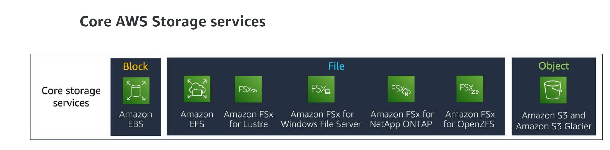
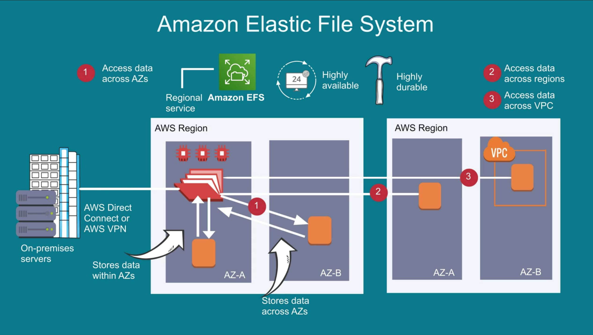
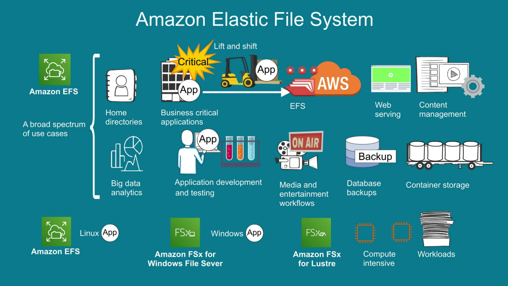
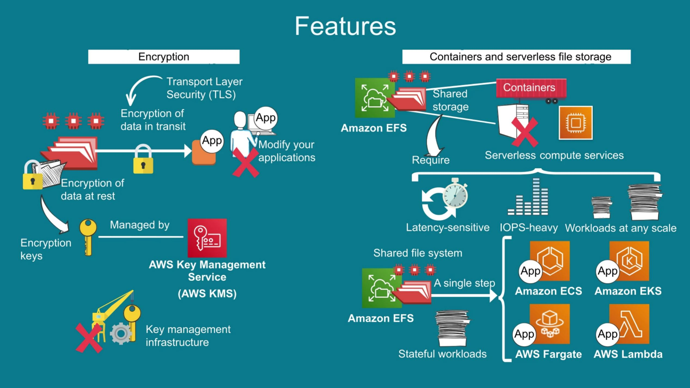
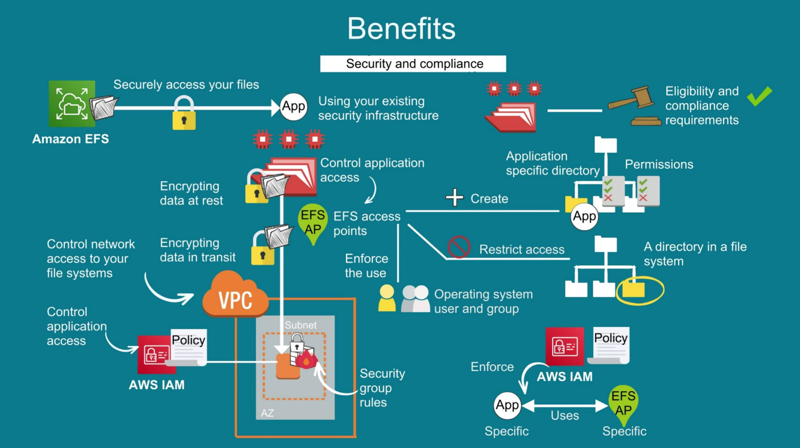
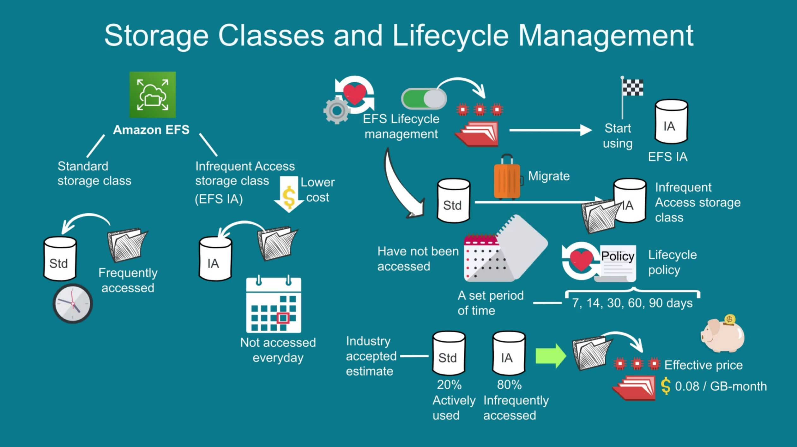
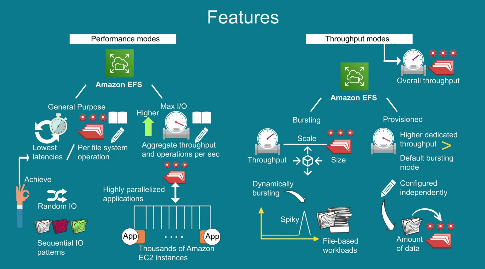
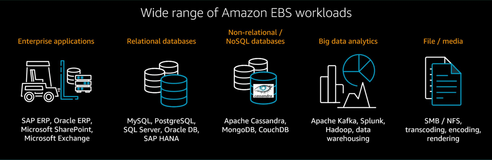

# AWS Storage

AWS Provides Block, file and Object Storage

## Block Storage

Block storage is raw storage in which the hardware storage device or drive is a disk or volume that is formatted and attached to the compute system for use. The storage is formatted into predefined continuous segments on the storage device. These segments are called blocks. The blocks are the basic fixed storage units used to store data on the device.

Storage devices can be hard disk drives (HDDs), solid state drives (SSDs), or newer types of storage devices, such as Non-Volatile Memory Express (NVMe). In addition to individual storage devices, you can deploy block storage on storage area network (SAN) systems.

The storage device is used by the operating system or an application that has the capabilities to manage block storage directly. For cases in which the application manages the block storage, the application often shares management with an operating system.

## File Storage

File storage is built on top of block storage, typically serving as a file share or file server. File storage is created using an operating system that formats and manages the reading and writing of data to the block storage devices. The name file storage comes from the primary use of storing data as files typically in a directory tree hierarchy.

The two most common storage protocols for file storage are Server Message Block (SMB) and Network File System (NFS). You can use the network protocols to communicate with remote computers and servers. You can also use server resources or share, open, and edit files.

The operating system manages the storage protocol and the operation of the file system. The file system can be Windows Server, Linux, or a specialized operating system used on network attached storage (NAS) devices or clustered NAS systems.

## Object Storage

Object storage is also built on top of block storage. Object storage is created using an operating system that formats and manages the reading and writing of data to the block storage devices. The name object storage comes from the primary use of storing the data within a binary object. Unlike file storage, object storage does not differentiate between types of data. The type of data or the file type becomes part of the data's metadata.

An object is made up of a larger set of blocks organized by using a predetermined size. For example, one object storage system uses binary object sizes of 128 megabytes (MB). Smaller files or data are stored at a binary level within the object. Larger data files are stored by spreading the data across multiple objects.

Object storage is recognized for its inherent availability of the file objects. Some systems support file versioning, file tracking, and file retention.

# EFS

# EFS Usecase

# EFS 

1. NFS protocol
2. NFS v4 version is followed by EFS
3. EFS allows file wise permission
4. file wise locking
5. Tree/directory structure
6. It can be connected to On-prim and EC2 and NFS drive. All can access parallel.
7. EFS is designed for linux
8. FSX is there for windows
9. 10 GB/second performance is granted
10. 10,000 I/O Ops is also available as part of performance
11. Storage space increases automatically, space is auto-scaled by AWS
12. EFS life cycle management allows less accessed file to moved low cost storage class for better cost optimization

# EFS Security

1. From application, security can be implemented by IAM policy
2. From network security point of view, Security Group can be used to protect
3. Per appliation specific folder EFS Access point can be used to create folder and permission

# EFS Storage class

2 type of storage class provided by EFS
1. Standard Storage Class
2. Infrequent Access storage Class ( low cost )

File can be moved from standard to IA class by enabling life cycle management based on some date configured, file can be moved.

2 types of performance mode available by EFS

Data Sync
AWS Backup

# EFS real world

1. Assume your EC2 instances do have 1 security group
2. create a Security Group and allow type as NFS and source from EC2 security group name. Outbound as allow all.
3. Create a NFS and towards last step it will ask for mount
4. In the mount choose target AZ, target subnet, newly created security group as step-2

# EBS

EBS volumes behave like raw, unformatted block devices. You can mount these block devices as EBS volumes on your EC2 instances. EBS volumes that are attached to an EC2 instance are exposed as raw block storage volumes that persist independently from the life of the instance. You can create a file system on top of these volumes or use them in any way you would use a block device (such as a hard drive). You can dynamically change the configuration of a volume attached to an EC2 instance, unlike traditional disk drives that come in fixed sizes.

You can choose from different EBS volume types to balance optimal price and performance. You can achieve single-digit millisecond latency for high-performance database workloads, such as SAP HANA, or gigabyte-per-second throughput for large, sequential workloads such as Apache Hadoop. You can change EBS volume types, tune performance, or increase volume size without disrupting your critical applications. Amazon EBS provides you cost-effective block storage when you need it.

Amazon EBS provides multiple volume types that you can use to optimize storage performance and cost for a broad range of applications. These volume types are divided into two major categories: SSD-backed storage for transactional workloads, such as databases, virtual desktops, and boot volumes, and HDD-backed storage for throughput-intensive workloads, such as MapReduce and log processing. 

1. SSD-based volumes include two levels to meet your application requirements: General Purpose SSD volumes and Provisioned IOPS SSD volumes.

2. General Purpose SSD volumes (gp3 and gp2) balance price and performance for transactional applications, including virtual desktops, test and development environments, and interactive gaming applications.
3. Provisioned IOPS SSD volumes are the highest performance EBS volumes (io2 and io1) for your most demanding transactional applications, including SAP HANA, Microsoft SQL Server, and IBM DB2.

1. HDD-based volumes include Throughput Optimized HDD (st1) for frequently accessed, throughput-intensive workloads and the lowest cost Cold HDD (sc1) for less frequently accessed data.